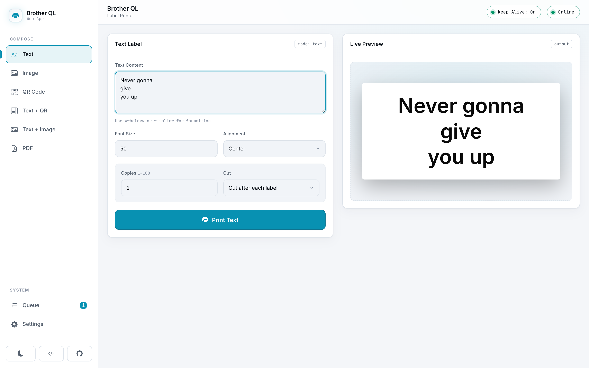
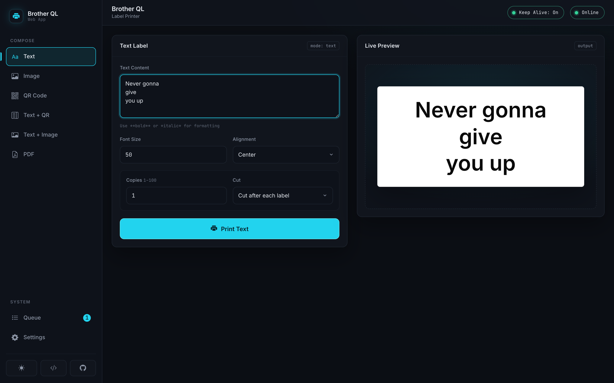
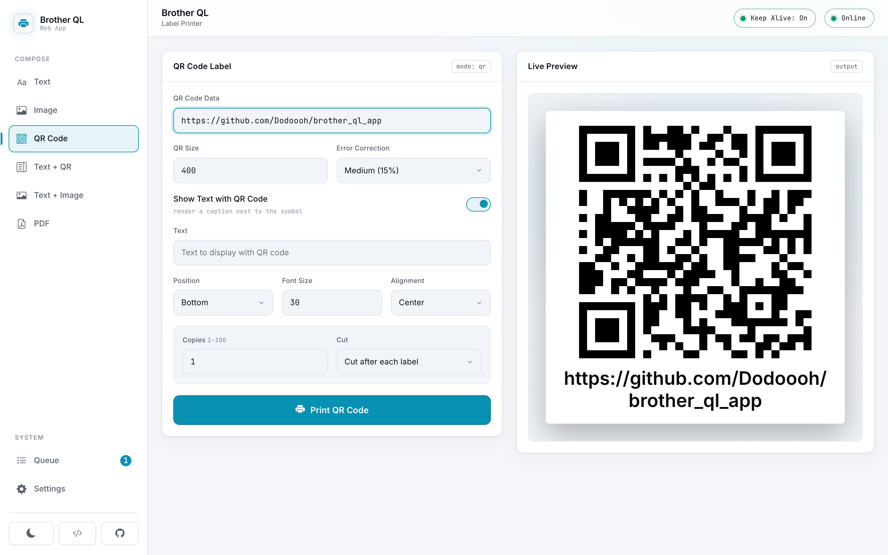
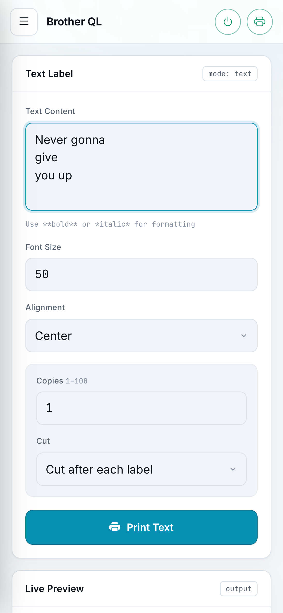

# Brother QL Printer App

[](https://hub.docker.com/r/dodoooh/brother_ql_app)
[](https://github.com/dodoooh/brother_ql_app/releases)
[](https://github.com/dodoooh/brother_ql_app/issues)
[](https://github.com/dodoooh/brother_ql_app/blob/main/changelog.md)

A modern web application to control Brother QL printers, enabling customizable text, image, and QR code printing with ease.

## 🚀 Features

- **🖋 Text Printing**: Easily print HTML-formatted text, such as `<b>Bold</b>` or `<span color="red">Red</span>`, for precise label designs.

- **🖼 Image Printing**: Upload and print images effortlessly to create visually appealing labels.

- **📱 QR Code Generation**: Create and print QR codes for URLs, contact information, or any text data.

- **🔀 Combined Layouts**: Print text and QR codes together — or text and an uploaded image side by side — with customizable positioning.

- **📄 PDF Printing**: Upload a PDF and print selected pages, with per-page preview and fit/fill scaling.

- **👁️ Live Preview**: See how your labels will look before printing for all label types, with an instant client-side preview backed by a true-to-print server render.

- **⚙️ Custom Settings**: Fine-tune font size, label size, alignment, rotation, threshold, dithering and red printing. Text can run across the tape or lengthwise along it on continuous rolls. Copies (1–100) and cut mode are available directly in every compose section.

- **🎯 Print Alignment Calibration**: Correct content that lands off-centre on the physical label, per label type — print a target, read the gap, nudge the print the same way, repeat. Applied when printing only; the preview always shows the label as you designed it.

- **🔎 Media Picker**: Find your label by the Brother product code printed on the box — `DK-11218` finds the 24 mm round label — with a button that copies the code for reordering.

- **🗂 Print Queue**: Submit multiple jobs and have them printed sequentially. Pause/resume the queue, emergency-stop (cancel all waiting jobs), delete individual jobs, reprint with the same settings, or re-open a job's parameters — all from the Queue panel.

- **🛡 Large-batch Confirmation**: Printing 10 or more copies requires an explicit confirmation in the UI and an explicit flag in the API, so a big run is never started by accident.

- **🔗 API Support**: Seamlessly integrate with external systems like Home Assistant ❤️ via a comprehensive, documented API.

- **🖨 Multiple Printer Support**: Control multiple printers simultaneously via the API, enabling the use of different label sizes and configurations for various tasks.

- **🔄 Printer Keep Alive**: Prevent your printer from shutting down with the keep alive feature — keep it awake continuously, or only for a configurable window after each print. A toggle in the top bar makes it accessible from anywhere.

- **📱 Responsive Design**: Enjoy a smooth user experience on desktop, tablet, and smartphone devices.

- **🌙 Dark Mode**: Modern interface with automatic dark mode support based on system preferences.

- **📚 Swagger Documentation**: Explore and test the API using the built-in Swagger UI documentation.

- **🔄 Error Handling**: Robust error handling with informative messages and toast notifications.

## 📸 Screenshots

### Desktop


### Dark Mode


### QR Code


### Mobile



## 🏗️ Architecture

The application follows a modern, API-first approach with clear separation of concerns:

- **Frontend**: Responsive web interface built with HTML5, CSS3, and JavaScript with Bootstrap 5 and Bootstrap Icons
- **Backend**: Python Flask application with Connexion for OpenAPI/Swagger integration
- **API**: RESTful API with comprehensive documentation and structured error responses
- **Services**: Modular services for printer communication, settings management, QR code generation, etc.

## 🐳 Installation with Docker

### Docker Image

The application is available as a Docker image from DockerHub:

```bash
# DockerHub
docker pull dodoooh/brother_ql_app:latest  # or specific version: dodoooh/brother_ql_app:v3.0.0
```

### Using Docker Compose

Create a `docker-compose.yml` file:

```yaml
version: '3.8'

services:
  brother_ql_app:
    image: dodoooh/brother_ql_app:latest
    container_name: brother_ql_app
    ports:
      - "5000:5000"
    volumes:
      - ./data:/app/data
      - ./uploads:/app/uploads
    restart: unless-stopped
```

Start the service:

```bash
docker-compose up -d
```

### Using Docker Run

Run the application with:

```bash
docker run -d \
  -p 5000:5000 \
  --name brother_ql_app \
  -v ./data:/app/data \
  -v ./uploads:/app/uploads \
  dodoooh/brother_ql_app:latest
```

### Access the Application

Open your browser and navigate to [http://localhost:5000](http://localhost:5000)

## 🛠️ Development Setup

### Prerequisites

- Python 3.11+
- pip
- Git

### Installation

1. Clone the repository:
   ```bash
   git clone https://github.com/dodoooh/brother_ql_app.git
   cd brother_ql_app
   ```

2. Run the setup script:
   ```bash
   ./run_app.sh
   ```
   
   This script will:
   - Create a virtual environment
   - Install dependencies
   - Start the application

3. Access the application at [http://localhost:5000](http://localhost:5000)

## Configuration

The application settings can be configured in the `data/settings.json` file. This file contains the default printer settings as well as the global options described below.

### Settings Fields

- `printer_uri`: The URI of the printer to use (e.g., `tcp://192.168.1.100` when over network, or `file:///dev/usb/lp0` when using USB)
- `printer_model`: The model of the printer (e.g., `QL-800`)
- `label_size`: The size of the label to print (e.g., `62`). Continuous rolls, rectangular die-cut labels (e.g. `62x29`) and round die-cut labels (`d12`, `d24`, `d58`) all work with every content type — text, images, PDF pages, QR codes and the combined layouts. On round media the content is laid out to the circle rather than to the square around it, so it is not clipped by the die cut
- `font_size`: The default font size used for text printing (e.g., `50`)
- `alignment`: The default text alignment (`left`, `center`, or `right`)
- `vertical_alignment`: How the text block sits across the label's height (`top`, `middle` — the default — or `bottom`), the counterpart to `alignment` along the width. Takes effect on die-cut labels and on continuous rolls set to `lengthwise`; a continuous roll printed `across` grows in length to fit the text exactly, so there is no spare height to move within
- `orientation`: How text runs on the label — `across` (the default: text runs across the tape and the label grows in length) or `lengthwise` (text runs along the tape, so the roll's printable width becomes the line height). Text labels on continuous rolls only; die-cut labels always print `across`
- `rotate`: The rotation applied to the rendered label in degrees (`0`, `90`, `180`, or `270`). `90` and `270` are currently not supported on rectangular die-cut labels, whose canvas is a fixed size in both directions — nor on a round die-cut label with `bleed_mm` set, whose canvas is no longer square either
- `threshold`: The black/white threshold used when converting the image (e.g., `70.0`)
- `dither`: Whether to apply dithering when converting the image (`true`/`false`)
- `compress`: Whether to enable printer-side compression (`true`/`false`)
- `red`: Whether to use the red channel for two-color labels such as 62-red (`true`/`false`)
- `copies`: The default number of copies to print (`1`–`100`)
- `cut_mode`: When to cut the tape — `each` (after every label), `end` (only after the last), or `none`
- `dpi_600`: Whether to print at 600 dpi where supported (`true`/`false`)
- `hq`: Whether to use high-quality printing (`true`/`false`)
- `keep_alive_enabled`: Whether to keep the printer connection alive (only needed for network printers)
- `keep_alive_interval`: The interval for keep-alive messages (in seconds, minimum `10`)
- `keep_alive_mode`: `forever` to keep the printer awake continuously, or `timed` to keep it awake only for a window after each print
- `keep_alive_duration_seconds`: When `keep_alive_mode` is `timed`, how long (in seconds) to stay awake after each print (e.g. `7200` for 2 hours)
- `ipp_port`: The IPP port used to query printer status (default `631`)
- `calibration`: Per-label print corrections, keyed by label identifier, e.g. `{"d24": {"x_mm": -0.5, "y_mm": 1.0, "scale": 0.98}}`. `x_mm` shifts the print sideways (above zero moves right), `y_mm` along the feed (above zero moves down), and `scale` (`0.95`–`1.05`) corrects a printer that lays ink down slightly larger or smaller than nominal. Applied when **printing only** — never to the preview, which stands for the label you designed. An absent map or an absent key means no correction. See [Print Alignment Calibration](#print-alignment-calibration) below
- `bleed_mm`: **Experimental.** How far a design may run outside the published printable area, keyed by label identifier, in millimetres per side, e.g. `{"d24": 2.0}` — **across the tape only**. Absent or `0` (the default) prints the area the app always has. It hands back the ~2 mm ring of paper the manufacturer declares unprintable, at the cost of a round label becoming an oval one; read [Bleed](#bleed-experimental) below before enabling it

### Print Alignment Calibration

Die-cut registration tolerance and per-model raster offsets can put the print slightly off-centre on the physical label — most visibly on round media, where a design that is mathematically centred can still print off the punched circle. A calibration corrects that, per label type. Open **Settings → Print Alignment → Calibrate**, then:

1. **Print the target.** It carries a ring (round media) or a frame (rectangular and continuous media) on the edge of the printable area, a centre crosshair, a millimetre scale on both axes and a caption naming the label and the offset it was printed with.
2. **Read the error off the label.** Compare two opposite gaps between the ring and the die cut; the correction is half their difference. The scale is printed next to the ring, so no ruler is needed.
3. **Move the print that way** with the direction pad (0.1 / 0.5 / 1 mm steps) and print again. The dialog keeps the stored value, the value of the last test print and the current draft on screen at once, so it is clear whether an adjustment is converging or overshooting. If the rings come out slightly too large or too small for the label, correct the size as well.
4. **Save** when it lands. Saving is a separate, reversible step and applies to that label type only.

Two things are worth knowing. The **preview never moves**: it is the label you designed, and the calibration exists to make the paper match it. And the **sideways travel is asymmetric**: the offset slides the whole raster along the print head, so nothing is ever cut off, but the room available depends on where the loaded media sits on the head — a 24 mm round label on a QL-820NWB has about 37 mm of travel one way and only 3.5 mm the other. A request beyond that is clamped to what the printer can reach, and the printed caption, the dialog and the API all report the applied value rather than the requested one. Along the feed there is no such lever: the content is moved inside the label's own canvas, so a large `y_mm` can push content off the edge, and on continuous media a positive `y_mm` trims the trailing edge instead of adding a lead-in.

### Bleed (experimental)

Every die-cut label is offered smaller than it is: 20 mm of a 24 mm round label is published as printable, so about 2 mm of paper all round is unreachable by any design — the bare ring you can measure on a finished label. `bleed_mm` hands that strip back, per label type. It is off by default, has no UI control, and is deliberately marked experimental:

- **It widens the label and never lengthens it.** Each raster line is one step of the paper feed, so extending the raster along the feed makes the media advance further per label and walks the cutter off the gap between labels until the roll loses registration. That is a hardware constraint, not a simplification — the extra feed steps cannot be given back.
- **A bled round label is an ellipse, not a circle** (24 × 20 mm on `d24`), and the layout follows that ellipse. Because the canvas is no longer square, `rotate` 90 and 270 stop working on a bled round label, exactly as they have never worked on rectangular die-cut labels.
- **What runs past the die cut lands on the liner**, and the die cut itself varies by a few tenths of a millimetre from label to label. Bleed is for backgrounds and colour meant to run off; keep text, codes and borders inside the published area.

Even coverage on the smaller circle is the better default, and remains the default. Whatever is asked for is clamped to what the medium and the print head can give (`5` on `d24` yields 2.03 mm); values above 5 mm are rejected as a wrong unit. Unlike `calibration`, bleed **does** show in the preview, because it changes how large the label you are designing is.

### Multiple Printers

To control more than one printer, define a `printers` array. Each entry describes a printer that can be selected via the API; the top-level fields above act as the default printer.

```json
{
    "printer_uri": "tcp://192.168.1.100",
    "printer_model": "QL-820NWB",
    "label_size": "62",
    "font_size": 50,
    "alignment": "left",
    "rotate": 0,
    "threshold": 70.0,
    "dither": false,
    "compress": false,
    "red": false,
    "keep_alive_enabled": true,
    "keep_alive_interval": 30,
    "ipp_port": 631,
    "printers": [
        {
            "id": "default",
            "name": "QL-820NWB (Office)",
            "printer_uri": "tcp://192.168.1.100",
            "printer_model": "QL-820NWB",
            "label_size": "62"
        },
        {
            "id": "label-station",
            "name": "QL-800 (Warehouse)",
            "printer_uri": "tcp://192.168.1.101",
            "printer_model": "QL-800",
            "label_size": "29"
        }
    ]
}
```

Each printer entry supports:

- `id`: A unique identifier used to reference the printer
- `name`: A human-readable label shown in the UI
- `printer_uri`: The URI of this printer (network or USB)
- `printer_model`: The model of this printer
- `label_size`: The default label size for this printer

### Environment Variables

The following environment variables can be set (e.g. in `docker-compose.yml` or via `docker run -e`):

- `API_KEY`: Opt-in API authentication. When set, every request to `/api/v1/*` must include the header `X-API-Key: <your-key>`. The bundled UI, static assets, Swagger UI and the health probes remain unauthenticated. When unset, the API is open.
- `CORS_ORIGINS`: Comma-separated list of allowed cross-origin origins (e.g. `https://home.example.com,https://hass.example.com`). When unset, only same-origin requests are allowed.
- `SECRET_KEY`: The Flask secret key. Set a stable value in production; if unset, an ephemeral random key is generated on each start.
- `ENABLE_SWAGGER_UI`: Set to `true` or `false` to force the Swagger UI on or off. When unset, the UI defaults to on unless `FLASK_ENV=production`.
- `UPLOAD_FOLDER`: Directory used to persist uploaded image/PDF files (job files and shared files). Defaults to an app-relative `uploads/` folder.
- `JOB_FILE_TTL_SECONDS`: How long persisted image/PDF job files are kept so they can be reprinted or re-opened (default `86400`, i.e. 24 hours).
- `SHARE_TTL_SECONDS`: How long files staged via the `/share` endpoint are kept before cleanup (default `3600`, i.e. 1 hour).

## 📔 API Documentation

The API is fully documented using OpenAPI/Swagger. You can access the interactive documentation at [http://localhost:5000/api/v1/ui/](http://localhost:5000/api/v1/ui/) when the application is running.

### Available Endpoints

**Settings & printers**
- **GET /api/v1/settings**: Get current settings
- **PUT /api/v1/settings**: Update settings
- **GET /api/v1/printers**: Get available printers
- **POST /api/v1/printers/status**: Check printer status
- **GET /api/v1/printers/keep-alive**: Get keep-alive status
- **PUT /api/v1/printers/keep-alive**: Start/stop the keep-alive feature

**Printing**
- **POST /api/v1/text/print**: Print text on a label
- **POST /api/v1/image/print**: Print image on a label
- **POST /api/v1/qrcode/print**: Print QR code on a label
- **POST /api/v1/label/text-qrcode**: Print combined text and QR code on a label
- **POST /api/v1/label/text-image**: Print an uploaded image and a text block side by side on a label
- **POST /api/v1/pdf/print**: Print selected pages of an uploaded PDF
- **POST /api/v1/share**: Generic share hand-off endpoint for mobile share shortcuts (image/PDF)

**Live preview** (true-to-print PNG render)
- **POST /api/v1/text/preview**, **/qrcode/preview**, **/label/preview**, **/image/preview**, **/pdf/preview**

**Calibration**
- **POST /api/v1/calibration/test-print**: Print the alignment target on a medium, optionally as a sweep
- **POST /api/v1/calibration/preview**: Render the same target as a PNG instead of printing it

**Print queue**
- **GET /api/v1/jobs**: List recent jobs (newest first)
- **GET /api/v1/jobs/{id}**: Get a single job's status
- **POST /api/v1/jobs/{id}/cancel**: Cancel a queued job
- **POST /api/v1/jobs/{id}/reprint**: Re-queue a job with the same settings
- **POST /api/v1/jobs/{id}/delete**: Delete a waiting or finished job
- **GET /api/v1/jobs/{id}/file**: Download a job's persisted image/PDF
- **POST /api/v1/jobs/clear**: Remove finished jobs
- **POST /api/v1/jobs/clear-all**: Remove all jobs
- **GET /api/v1/jobs/queue**: Queue control status (paused + counts)
- **POST /api/v1/jobs/pause** · **/jobs/resume** · **/jobs/stop**: Control queue processing

**Health**
- **GET /health**: Liveness probe reporting that the web application process is up
- **GET /health/printer**: Readiness probe reporting whether the configured printer is reachable

> **Large batches:** Any print request that would print 10 or more copies must include an explicit `confirm_large_batch` flag (boolean `true` for JSON endpoints, the string `"true"` for multipart endpoints). Without it the request is rejected with HTTP 400 and the error code `CONFIRMATION_REQUIRED`.

> **Optional `settings`:** On every print and preview endpoint, `settings` (and any field within it) is optional — anything omitted is taken from the app's saved configuration, with request fields overriding. So printing on the configured printer needs no `settings` at all.

> **Raw PNG previews:** The preview endpoints (`/text/preview`, `/qrcode/preview`, `/label/preview`, `/image/preview`) return the JSON wrapper `{"image": "data:image/png;base64,…"}` by default. Send `Accept: image/png` to instead receive the raw PNG bytes (with `X-Label-Width-Px` / `X-Label-Height-Px` headers) — handy for piping a preview straight to an ``.

> **Automatic wrapping:** Long text is wrapped at word boundaries to fit the label (over-long words are hard-broken) instead of being truncated — for plain text, text+QR and QR captions, in both print and preview. It is on by default; disable per request with `text.wrap: false` (or `settings.text_wrap: false`).

> **Lengthwise text:** Set `settings.orientation` to `lengthwise` on `/text/print` or `/text/preview` to run the text along the tape instead of across it: the roll's printable width becomes the line height and the tape grows with the message, so a long text on a narrow roll prints as one continuous strip instead of a shrunken column. The text reads bottom-to-top when the strip is held upright — add `rotate: 180` for the opposite direction. Continuous rolls only; die-cut labels have a fixed size in both directions and always render `across` (the default).

> **Vertical alignment:** `settings.vertical_alignment` (`top`, `middle`, `bottom`) positions the text block across the label's height on `/text/print` and `/text/preview`, the counterpart to `alignment` along the width. It has room to work on die-cut labels — most visibly on round media such as `d24`, where a centred line leaves a lot of space above and below — and on continuous rolls set to `lengthwise`, where it moves the text across the tape width. On a continuous roll printed `across` (the default) the label grows in length to fit the text exactly, so there is no spare height and the setting has no effect. The default `middle` matches the previous behaviour.

> **Print alignment calibration:** `settings.calibration` carries a per-label correction in millimetres — `{"d24": {"x_mm": -0.5, "y_mm": 1.0, "scale": 0.98}}` — that is applied on the way to the printer on every print endpoint. It is normally stored once via `PUT /settings`; sending it in a print request applies it to that job alone. The **preview endpoints deliberately ignore it**, because the preview is the label you designed and the calibration exists to make the paper match it. `POST /calibration/test-print` prints the target you measure against (and accepts `dry_run`, plus an opt-in `sweep` of several numbered targets stepping around the current value); `POST /calibration/preview` renders the same target — the one preview that does show the offset, since where the ink lands is its subject. Sideways travel is bounded by how much print head sits beside the loaded media and is usually asymmetric, so a request beyond it is clamped: the response reports `offsets_mm`, `requested_offsets_mm`, `clamped` and `sideways_travel_mm`, and the printed caption names the offset actually applied. See [Print Alignment Calibration](#print-alignment-calibration) for the measuring loop.

> **Bleed (experimental):** `settings.bleed_mm` (`{"d24": 2.0}`) lets a design run outside the published printable area, in millimetres per side and **across the tape only** — the feed direction is unavailable, because extra raster lines are extra feed steps and they walk the cutter off the label gap. It is absent by default. Unlike `calibration` it **does** affect previews, so a preview requested with it comes back wider. A bled round label is an ellipse rather than a circle, which also makes `rotate` 90/270 unavailable on it. Requests are clamped to the medium's real margin, and `POST /calibration/test-print` reports the per-medium ceiling in its `bleed` block (`requested_mm`, `applied_mm`, `limit_mm`, `clamped`). See [Bleed](#bleed-experimental) for what you are opting into.

> **Dry run:** Add `dry_run: true` to any print request to validate it end-to-end (render + printer reachability) **without** printing or queueing — ideal for endless (62 mm) media and CI. The response is `{ "ok": true, "dry_run": true, "printer_reachable": …, "would_print": { "label_size", "copies", "width_px", "height_px" } }`.

## 📤 Example API Usage

### **Text Printing**

Use the `/api/v1/text/print` endpoint to print formatted text.

```python
import requests

url = 'http://localhost:5000/api/v1/text/print'
payload = {
    "text": {
        "content": "Hello World!\nThis is a test print.",
        "font_size": 40,
        "alignment": "center"
    },
    "settings": {
        "printer_uri": "tcp://192.168.1.100",
        "printer_model": "QL-800",
        "label_size": "62",
        "rotate": 90,
        "threshold": 70.0,
        "dither": True,
        "compress": True,
        "red": False
    }
}

response = requests.post(url, json=payload)

if response.status_code == 200:
    print("Success:", response.json())
else:
    print("Error:", response.status_code, response.json())
```

### **Image Printing**

Use the `/api/v1/image/print` endpoint to upload and print an image.

```python
import requests
import json

url = 'http://localhost:5000/api/v1/image/print'
image_path = '/path/to/image.jpg'  # Replace with the path to your image
settings = {
    "settings": {
        "printer_uri": "tcp://192.168.1.100",
        "printer_model": "QL-800",
        "label_size": "62",
        "rotate": 180,
        "threshold": 70.0,
        "dither": False,
        "compress": False,
        "red": True
    }
}

with open(image_path, 'rb') as img_file:
    files = {
        'image': img_file
    }
    data = {
        'settings': json.dumps(settings["settings"])
    }
    response = requests.post(url, files=files, data=data)

if response.status_code == 200:
    print("Success:", response.json())
else:
    print("Error:", response.status_code, response.json())
```

### **QR Code Printing**

Use the `/api/v1/qrcode/print` endpoint to generate and print a QR code.

```python
import requests

url = 'http://localhost:5000/api/v1/qrcode/print'
payload = {
    "qr": {
        "data": "https://github.com/dodoooh/brother_ql_app",
        "box_size": 10,
        "border": 4,
        "error_correction": "M",
        "version": 1,
        "size": 400
    },
    "settings": {
        "printer_uri": "tcp://192.168.1.100",
        "printer_model": "QL-800",
        "label_size": "62",
        "rotate": 0,
        "threshold": 70.0,
        "dither": False,
        "compress": False,
        "red": False
    }
}

response = requests.post(url, json=payload)

if response.status_code == 200:
    print("Success:", response.json())
else:
    print("Error:", response.status_code, response.json())
```

### **Combined Text and QR Code**

Use the `/api/v1/label/text-qrcode` endpoint to print text and QR code together.

```python
import requests

url = 'http://localhost:5000/api/v1/label/text-qrcode'
payload = {
    "text": {
        "content": "Product: Widget XYZ\nSKU: 12345\nPrice: $19.99",
        "font_size": 30,
        "alignment": "left"
    },
    "qr": {
        "data": "https://github.com/dodoooh/brother_ql_app",
        "box_size": 10,
        "border": 4,
        "error_correction": "M",
        "position": "right",
        "size": 400,
        "version": 1
    },
    "settings": {
        "printer_uri": "tcp://192.168.1.100",
        "printer_model": "QL-800",
        "label_size": "62",
        "rotate": 0,
        "threshold": 70.0,
        "dither": False,
        "compress": False,
        "red": False
    }
}

response = requests.post(url, json=payload)

if response.status_code == 200:
    print("Success:", response.json())
else:
    print("Error:", response.status_code, response.json())
```

### **Printer Keep Alive**

Use the `/api/v1/printers/keep-alive` endpoint to control the printer keep alive feature.

```python
import requests

url = 'http://localhost:5000/api/v1/printers/keep-alive'

# Enable keep alive feature
payload = {
    "settings": {
        "printer_uri": "tcp://192.168.1.100",
        "printer_model": "QL-800"
    },
    "keep_alive": {
        "enabled": True,
        "interval": 300  # Interval in seconds (5 minutes)
    }
}

response = requests.post(url, json=payload)

if response.status_code == 200:
    print("Success:", response.json())
else:
    print("Error:", response.status_code, response.json())

# Disable keep alive feature
payload = {
    "settings": {
        "printer_uri": "tcp://192.168.1.100",
        "printer_model": "QL-800"
    },
    "keep_alive": {
        "enabled": False
    }
}

response = requests.post(url, json=payload)

if response.status_code == 200:
    print("Success:", response.json())
else:
    print("Error:", response.status_code, response.json())
```

## 🔄 Keep Alive

Network Brother QL printers tend to power themselves off automatically after a period of inactivity. The keep-alive feature periodically writes to the printer's raw port (`9100`) at the configured `keep_alive_interval` to keep the connection warm and reduce the chance of an unexpected power-off.

> **Note:** Keep-alive is a best-effort mitigation. The only guaranteed way to prevent the printer from shutting down is to disable the device's own power-saving setting (set **Auto Power Off = Off** in the printer's menu).

Keep-alive can run in two modes (configurable in the settings):

- **Forever**: keeps the printer awake continuously while enabled.
- **Timed**: keeps the printer awake only for a configurable window after each print (e.g. 2 hours), then lets it sleep until the next print.

A keep-alive toggle is always available in the top bar so it can be turned on or off from any view.

## 🗂 Print Queue

All print requests are queued and processed sequentially by a single background worker, so the printer (which accepts only one connection at a time) is never driven concurrently. The **Queue** panel lists recent jobs with their status (`queued`, `printing`, `done`, `failed`, `cancelled`) and lets you:

- **Pause/Resume** processing — a job that is already printing finishes; the next ones wait.
- **Stop** — an emergency stop that pauses the queue and cancels all waiting jobs (a printing job still finishes).
- **Reprint** a job with the same settings, or **Open** its parameters back into the form.
- **Delete** a single waiting or finished job, **Clear finished**, or **Clear all**.

The same controls are available via the `/api/v1/jobs/*` endpoints listed above. Image and PDF jobs keep their uploaded file for a configurable time (`JOB_FILE_TTL_SECONDS`, default 24 h) so they can be reprinted or re-opened.

## 📲 Share from your Phone

The generic `/share` endpoint lets you send a PDF or image straight from your phone into the print form using **Apple Shortcuts** (iOS) or **HTTP Shortcuts** (Android) — no PWA required.

Send the file as a `multipart/form-data` POST with a `file` field to `POST /api/v1/share`. The server detects whether it is a PDF or an image (via magic bytes, content type or extension), stages it under a random token, and responds with a `302` redirect to `/?share=<token>&type=<pdf|image>`. Opening that URL loads the file into the matching tab (PDF or Image), ready to print with a single tap.

```bash
curl -i -F "file=@label.pdf" http://localhost:5000/api/v1/share
# -> 302 Location: /?share=<token>&type=pdf
```

On a phone, create a Shortcut that takes the shared file and performs a "Get contents of URL" `POST` to `http://<host>:5000/api/v1/share` with the file as a form field named `file`, then opens the returned URL.

Staged files live in `uploads/shared/` and are automatically removed after `SHARE_TTL_SECONDS` (default `3600`, i.e. 1 hour).

## 📝 License

This project is licensed under the [Creative Commons Attribution-NonCommercial-ShareAlike 4.0 International Public License](LICENSE).

## 🤝 Contributing

Contributions are welcome! Please open an issue or submit a pull request.

## 👏 Acknowledgments

Special thanks to our contributors:

- **DL6ER** - For adding support for additional printer models, label types, and adding USB printer support
- **[MSanteler](https://github.com/MSanteler)** - For finding and diagnosing the hardcoded label width, which meant every roll narrower than 62 mm printed at the wrong scale

## 📄 Changelog

See [CHANGELOG.md](changelog.md) for more information.

---

**Enjoy using the Brother QL Printer App! If you encounter any issues or have suggestions for improvements, feel free to reach out through our [GitHub Issues](https://github.com/dodoooh/brother_ql_app/issues).**
