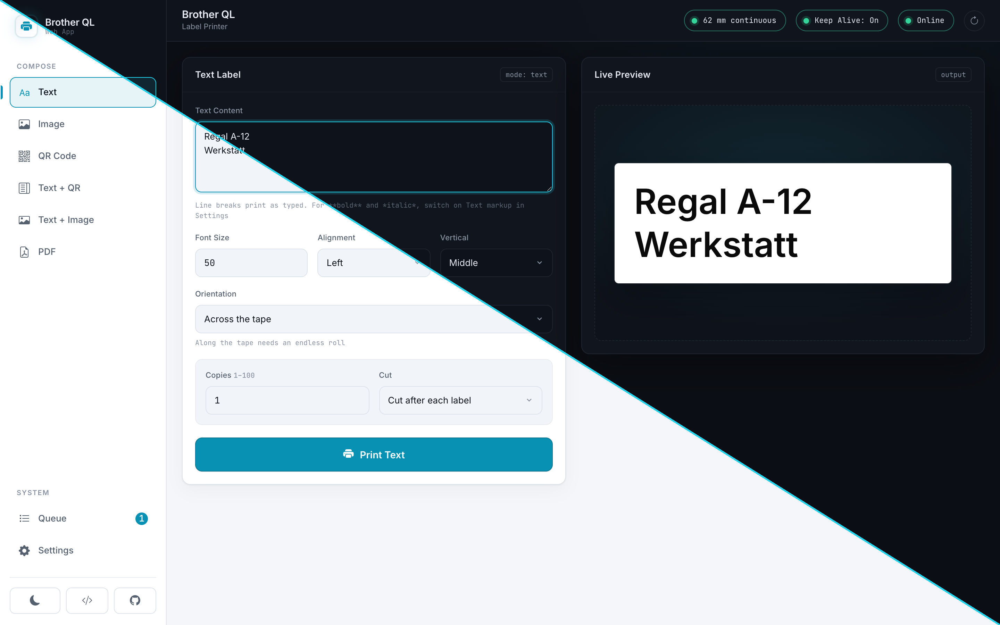
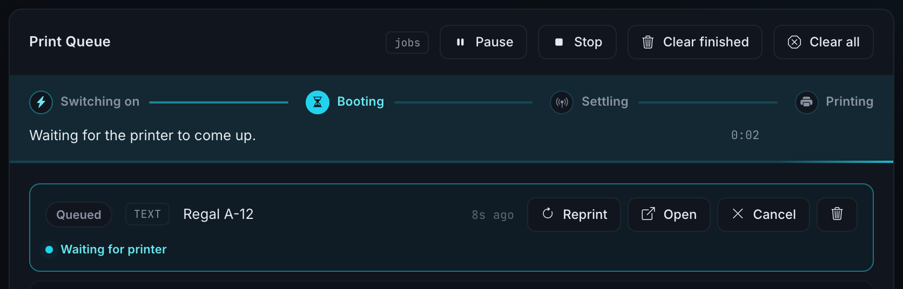
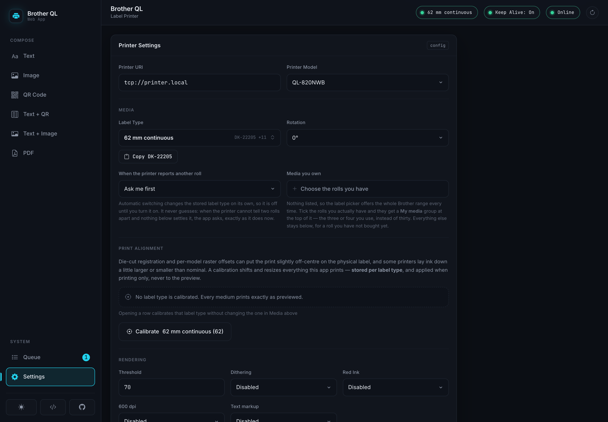
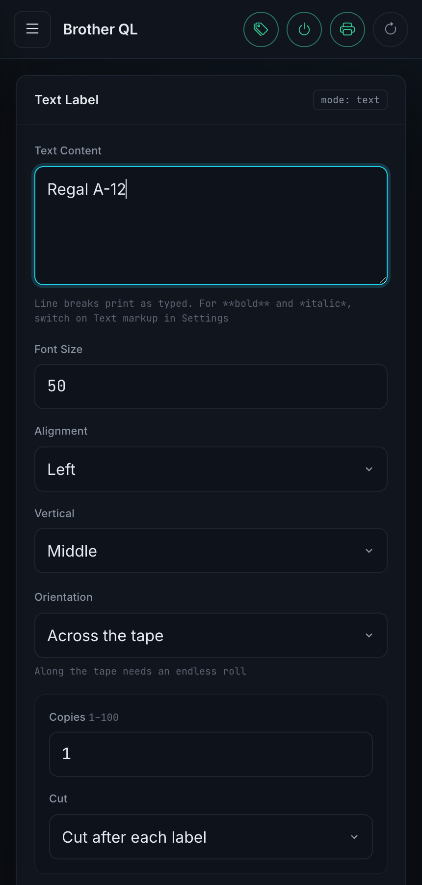

# Brother QL Printer App

[](https://github.com/Dodoooh/brother_ql_app/stargazers)
[](https://github.com/Dodoooh/brother_ql_app/actions/workflows/ci.yml)
[](https://hub.docker.com/r/dodoooh/brother_ql_app)
[](https://hub.docker.com/r/dodoooh/brother_ql_app/tags)
[](https://github.com/dodoooh/brother_ql_app/releases)
[](https://github.com/Dodoooh/brother_ql_app/issues)
[](LICENSE)

A web interface and REST API for Brother QL label printers. Compose a label in
the browser or send it from a script. The app renders it, queues it and prints
it over the network, over USB, or through a Linux device node.

[](https://dodoooh.github.io/brother_ql_app/)

[](https://dodoooh.github.io/brother_ql_app/)

**[Open the demo](https://dodoooh.github.io/brother_ql_app/)**. It is the real
interface with a simulated printer behind it, runs entirely in your browser, and
prints nothing.


## Features

- Text, images, QR codes and PDFs, plus combined layouts (text with a QR code or
  an image beside it)
- A live preview rendered by the same code that drives the printer
- A print queue with per-job status, reprint and cancel
- Media detection: the app can read which roll is loaded and follow it
- Print alignment calibration per label type, with an optional bleed
- Round die-cut labels, and text that runs lengthwise along continuous tape
- Optional mains power control through a relay
- Keep-alive for network printers that fall asleep
- A documented REST API with a Swagger UI, for Home Assistant, Apple Shortcuts
  or a shell script

## Quick start

```yaml
# docker-compose.yml
services:
  brother_ql_app:
    image: dodoooh/brother_ql_app:dev
    container_name: brother_ql_app
    ports:
      - "5000:5000"
    volumes:
      - ./data:/app/data
    restart: unless-stopped
    environment:
      - PYTHONPATH=/app
      - FLASK_ENV=production
```

```bash
docker compose up -d
```

The interface is then at `http://<host>:5000` and the API documentation at
`http://<host>:5000/api/v1/ui/`. Set your printer address under Settings or with
`PUT /api/v1/settings`.

The API is open to whoever can reach the port. That matches what it drives: a
label printer accepts a raster on port 9100 from anyone on the same network, with
or without this app in front of it. Give it a network you trust, or a reverse
proxy, and see `API_KEY` below if you run it without the interface.


## Printing from a script

```bash
curl -X POST http://<host>:5000/api/v1/text/print \
  -H 'Content-Type: application/json' \
  -d '{
        "text": "Shelf A-12",
        "settings": { "label_size": "62", "font_size": 50 }
      }'
```

The call returns a job id straight away. Poll `GET /api/v1/jobs/{id}` if you need
the result. Add `-H 'X-API-Key: ...'` if you set that variable. Image and PDF
upload, QR codes, combined layouts, printer status and queue control work the
same way and are documented in the Swagger UI, which is generated from the
specification the server routes on. The demo carries the same reference as a
[static page](https://dodoooh.github.io/brother_ql_app/api/), for reading it
without installing anything.

## Print queue

Jobs are printed one at a time, because the printer accepts one connection at a
time. The queue shows what each job is doing, including the phases a job passes
through while it waits for a printer to become available.



## Mains power control

A Brother QL starts up on its own as soon as mains power returns, at least the
QL-820NWB this was built against. That makes a relay in front of it a remote
power switch: cutting the supply switches the printer off, restoring it switches
the printer on, and nobody has to walk over and press the button.


The relay is anything that can be driven by a webhook: a Shelly, a Tasmota plug,
an ESPHome switch, or a Node-RED flow in front of one. The app closes it when a
job arrives at a printer that is not answering, and opens it again once the
configured window has passed.



A printer that has just been switched on needs time. The app waits for it,
holding the job in the queue instead of failing it, and retries the print a few
times while the device settles. The waiting times come from watching a QL-820NWB
boot, so they are one printer's numbers for now.

The feature is off by default, and switching the printer *off* again is a
separate setting. `printer_auto_power_off_minutes` should match what the
printer's own menu shows, since the app subtracts it from the keep-alive window
and has no way to read it from the device.


## Configuration

Settings live in `data/settings.json`. Edit them in the interface or with
`PUT /api/v1/settings`. Any of them can also be sent with a single print request
under `settings`, where they override the stored value for that job only.

**Printer**

| Setting | Default | What it does |
|---|---|---|
| `printer_uri` | `tcp://192.168.1.100` | Also `usb://0x04f9:0x209b` or `file:///dev/usb/lp0` |
| `printer_model` | `QL-800` | For example `QL-820NWB` |
| `label_size` | `62` | The loaded media, for example `62`, `62red` or `d24` |
| `ipp_port` | `631` | Port used for status, media detection and the printer clock |
| `printers` | one entry | A list of printers to choose from. The fields above are the default one |

**Layout and rendering**

| Setting | Default | What it does |
|---|---|---|
| `font_size` | `50` | Starting size. Shrinks further if the text does not fit |
| `alignment` | `left` | `left`, `center` or `right` |
| `vertical_alignment` | `middle` | `top`, `middle` or `bottom`, where the medium leaves room |
| `orientation` | `across` | `lengthwise` runs the text along continuous tape |
| `text_markup` | `false` | Honour `**bold**` and `*italic*`. Sets the base text lighter |
| `rotate` | `0` | Rotates the finished label by `0`, `90`, `180` or `270` |
| `threshold` | `70.0` | Where grey turns into black, in percent |
| `dither` | `false` | Dither instead of thresholding. Better for photographs |
| `red` | `false` | Two-colour printing on red media such as `62red` |
| `dpi_600`, `hq` | `false`, `true` | Higher resolution and quality mode, where the model supports it |
| `compress` | `false` | Compresses the raster on the way to the printer |
| `copies`, `cut_mode` | `1`, `each` | Number of labels and when to cut: `each`, `end` or `none` |
| `calibration` | `{}` | Per label type: offset in millimetres and a size correction |
| `bleed_mm` | `{}` | Per label type: prints into the unprintable margin. Experimental |

**Media detection**

| Setting | Default | What it does |
|---|---|---|
| `media_auto_switch` | `false` | Adopt the roll the printer reports as loaded |
| `owned_media` | `[]` | The media you actually have. Narrows an ambiguous roll to one |
| `media_preference` | `{}` | Which variant wins where a roll stays ambiguous |
| `media_memory` | `{}` | What was last used on each medium. Maintained by the app |

**Keep-alive and mains power**

| Setting | Default | What it does |
|---|---|---|
| `keep_alive_enabled` | `false` | Keeps a network printer from falling asleep |
| `keep_alive_interval` | `60` | Seconds between heartbeats |
| `keep_alive_mode` | `forever` | `timed` stops after the window below |
| `keep_alive_duration_seconds` | `7200` | Length of that window, measured from the last print |
| `relay_webhook_enabled` | `false` | Mains power control, see above |
| `relay_webhook_turn_on_url` | empty | POSTed to switch the printer on |
| `relay_webhook_turn_off_url` | empty | Empty means the turn-on URL is reused |
| `relay_webhook_turn_off_enabled` | `false` | Opt in separately to switching off |
| `relay_webhook_turn_off_delay_minutes` | `5` | Grace period after the keep-alive window closes |
| `printer_auto_power_off_minutes` | `10` | The printer's own timer. Subtracted from the window above |

Environment variables:

| Variable | Default | Purpose |
|---|---|---|
| `API_KEY` | unset | Requires `X-API-Key` on `/api/v1`. The bundled interface does not send it and stops working, so this suits API-only installations |
| `CORS_ORIGINS` | same-origin | Comma-separated list of allowed origins |
| `UPLOAD_FOLDER` | `src/uploads` | Where rendered labels and uploads are staged |
| `MAX_UPLOAD_IMAGE_PIXELS` | `50000000` | Larger images are refused before they are decoded |
| `MAX_PDF_PAGES` | `20` | Larger page selections are refused before rendering |
| `JOB_FILE_TTL_SECONDS` | `86400` | How long job files are kept |
| `RELAY_WEBHOOK_AUTHORIZATION` | unset | Sent as the relay webhook's `Authorization` header |
| `LOG_LEVEL` | `INFO` | Python logging level |

The relay credential is an environment variable and not a setting, because
`GET /settings` returns the configuration to any client that can read it.

## Tested printers and media

What has actually been printed, rather than what the label catalogue says is
possible. The app knows about far more media than this table lists; these are
the combinations somebody has held in their hand.

| Printer | Media | Tested by | Date | Version |
|---|---|---|---|---|
| QL-820NWB | 62 mm continuous (`62`) | Dodoooh | 2026-08-04 | 4.0.0-rc.1 |
| QL-820NWB | 12 mm continuous (`12`) | Dodoooh | 2026-08-04 | 4.0.0-rc.1 |
| QL-820NWB | 24 mm round die-cut (`d24`) | Dodoooh | 2026-08-04 | 4.0.0-rc.1 |

If you print on something that is not in the table, a line here is welcome:
printer, media, and whether anything needed calibration.


## On a phone

The interface works on one, and `POST /api/v1/share` accepts a file from the iOS
share sheet or an Android HTTP Shortcut and hands it to the print form.



## Development

```bash
python3 -m venv venv && source venv/bin/activate
pip install -r requirements-dev.txt
python src/app.py
```

Python 3.11 is required. The test suite needs a TrueType font installed
(`fonts-dejavu`); without one, about a third of it skips.

```bash
pytest
```

`src/api/openapi.yaml` is the source of truth for routing. An endpoint changes
there and in its controller, or it does not change.

## AI assistance

Yes, this project is built with AI assistance. It belongs to the toolchain like
anything else here, and what comes out of it is reviewed and tested by a human
before it lands. Keeping a project this size moving, mostly alone and in spare
time, would not otherwise be realistic.

## Contributing

Contributions are welcome. Open an issue or send a pull request. Reports from
printers and media that are not in the table above are useful too.

## Acknowledgments

- **DL6ER** for support for additional printer models and label types, and for
  USB printing
- **[MSanteler](https://github.com/MSanteler)** for finding and diagnosing the
  hardcoded label width, which meant every roll narrower than 62 mm printed at
  the wrong scale

## Changelog

[changelog.md](changelog.md).

## Licence

CC BY-NC-SA 4.0. See [LICENSE](LICENSE).
